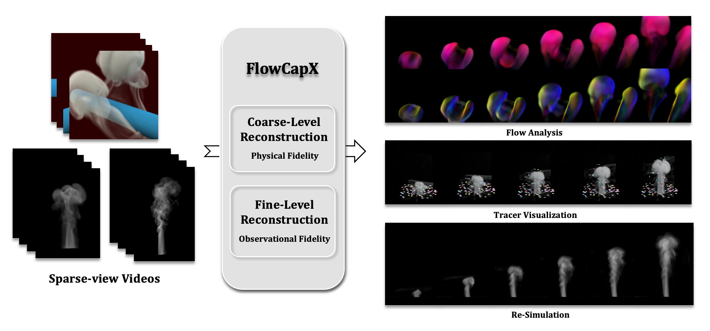

# FlowCapX: Physics-Grounded Flow Capture with Long-Term Consistency

This is the official repository for our paper, "FlowCapX: Physics-Grounded Flow Capture with Long-Term Consistency". You can visit [website](https://taoningxiao.github.io) to read the paper and other materials.
<p align="center">
  
</p>

## Installation

### Prerequisites

- Linux environment
- CUDA 11.6 (tested)

### Setup

Create a conda environment and install dependencies:

```bash
# Build environment with Python 3.7
conda create -n flowcapx python=3.7
conda activate flowcapx 

# Install FFmpeg if not already installed (test by ffmpeg -version)
conda install -c conda-forge ffmpeg 
conda install ffmpeg

# Install requirements
pip install -r requirements.txt 

# Install raymarching
cd raymarching
pip install -e .

# Test environment
cd ..
python env_test.py
```

## Usage

### Training

Download the data through [google drive](https://drive.google.com/file/d/1C7aMrQu8Sjj8NIc7AuNtBH_c-_Le6NzG/view?usp=sharing). 

The training process consists of three stages:

#### Stage 1: Density Training
```bash
python train_density.py --config configs/recons-cyl/train_dens.txt
```

#### Stage 2: Joint Training
First, update the `model_path`, `occ_dynamic_path`, and `occ_static_path` in `train_j.txt` with the checkpoint from Stage 1, then run:
```bash
python train_jointly.py --config configs/recons-cyl/train_j.txt
```

#### Stage 3: High-Frequency Training
First, update the `model_path` and `siren_model_path` in `train_hfreq.txt` with the checkpoint from Stage 2, then run:
```bash
python train_hfreq.py --config configs/recons-cyl/train_hfreq.txt
```

### Evaluation
First, update the `model_path`, `occ_dynamic_path`, `occ_static_path`, and `siren_model_path` in `eval.txt` with the results from joint training, and set `load_path` to the checkpoint from high-frequency training. Second, update the ground truth paths (`gt_prefix`, `gt_ext`, `gt_dens_prefix`, `gt_dens_ext`) to point to your GT data.

#### Velocity Field Evaluation
```bash
python evaluate.py --config configs/recons-cyl/eval.txt --vis_vel
```

#### Re-simulation
```bash
python evaluate.py --config configs/recons-cyl/eval.txt --resim
```

## Citation

If you use this code in your research, please cite our paper:

```bibtex
@inproceedings{tao2025flowcapx,
  title={FlowCapX: Physics-Grounded Flow Capture with Long-Term Consistency},
  author={Tao, N and Zhang, L and Ni, X and Chu, M and Chen, B},
  booktitle={Computer Graphics Forum},
  pages={e70274},
  year={2025},
  organization={Wiley Online Library}
}
```

## License

This project is licensed under the MIT License - see the [LICENSE](LICENSE) file for details.

## Contact

For questions and support, please open an issue on GitHub or contact me at [taoningxiao@outlook.com].